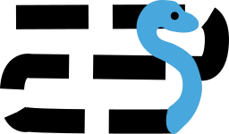

# Introduction

## What is curvewalk?

Curvewalk is a python library that provides a straightforward implementation of space-filling curves over an array or fixed size. It supports various curves, including the Lawnmower (Boustrophedon) and Hilbert curves, allowing for traversal of multi-dimensional data structures.

## What is a space-filling curve?

A space-filling curve is a curve or path which travels through every point in a region, for example a 2D or 3D array, without leaving any gaps.

## What curves are supported?

* Lawnmower or Boustrophedon over arbitrary array sizes and dimensions.
* Hilbert curve over 2D square power of two arrays.

## Licence

Curvewalk is licensed under the MIT License.
